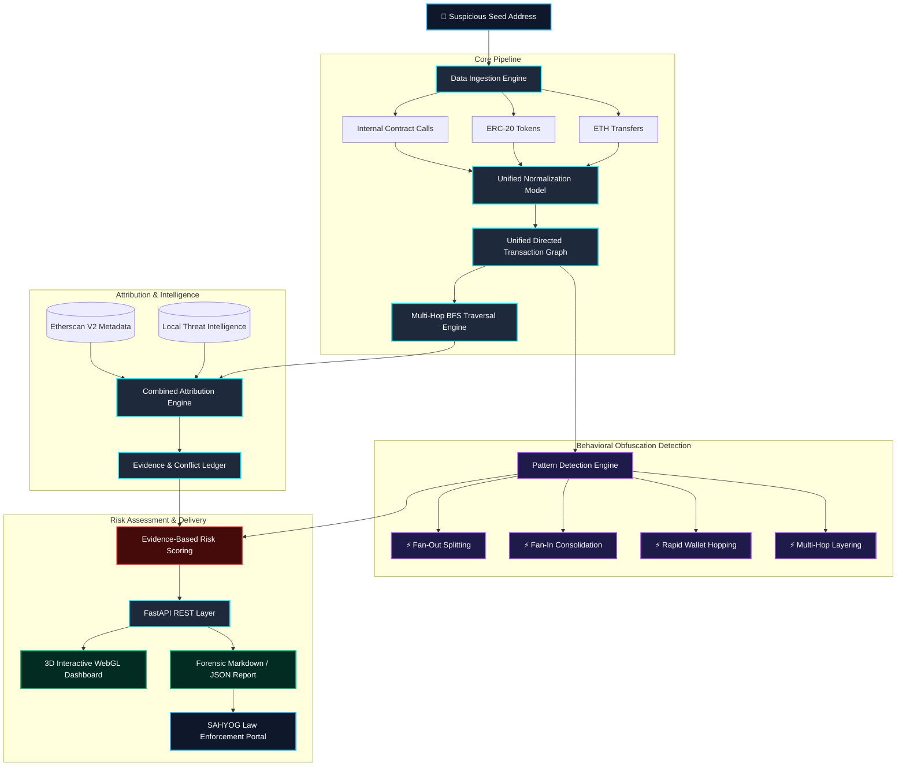

<div align="center">

# 🛡️ Crypto Attribution Engine v2.0
### *Next-Gen Cybercrime Blockchain Forensics, 3D Cyberspace Visualization & SAHYOG Threat Attribution*

[](https://github.com/zunzunn/crypto-attribution-engine/actions/workflows/backend-ci.yml)
[](https://github.com/zunzunn/crypto-attribution-engine/actions/workflows/frontend-ci.yml)
[](https://github.com/zunzunn/crypto-attribution-engine/actions/workflows/main-ci.yml)
[](https://www.docker.com/)
[](https://python.org)
[](https://fastapi.tiangolo.com)
[](https://react.dev)
[](https://threejs.org)
[](https://tailwindcss.com)
[](LICENSE)

<p align="center">
  <b>Automated multi-hop fund tracing, behavioral obfuscation detection, entity attribution, and evidence-based risk scoring designed for cybercrime investigators and law enforcement authorities.</b>
</p>

[Explore Features](#-key-capabilities) • [Architecture](#-system-architecture) • [Quick Start](#-quick-start) • [Interactive 3D UI](#-realtime-3d-interactive-dashboard) • [API Docs](#-api-endpoints) • [Contributing](#-contributing--branching-workflow)

---

</div>

## 📌 Executive Summary & Thesis Context

Cryptocurrency scammers and cybercriminals intentionally obscure stolen assets across complex transaction paths: **wallet hopping, fan-out splitting, fan-in consolidation, privacy mixers (Tornado Cash), cross-chain bridges, and VASP exchange deposit endpoints**. 

The **Crypto Attribution Engine** automates the labor-intensive blockchain investigation pipeline:
- Ingests native **ETH**, **ERC-20** (USDT, USDC with decimal normalization), and **internal contract transactions**.
- Builds directed multi-graphs and performs bounded **Breadth-First Search (BFS) multi-hop tracing**.
- Discovers and attributes addresses against **Intelligence Registries** and **Etherscan Nametag Metadata** with explicit provenance.
- Detects complex **laundering obfuscation patterns** (Splitting, Consolidation, Rapid Hopping, Layering).
- Produces court-admissible, evidence-based **Investigative Risk Scores** and **SAHYOG-compliant forensic reports** for swift asset freezing.

---

## 🏛️ System Architecture



---

## 🚀 Key Capabilities

### 1. 🌐 Realtime 3D WebGL Cyberspace Visualizer
- **Living Blockchain Particle Constellation:** 180+ floating nodes with dynamic proximity laser connections drifting in 3D coordinate space.
- **Realtime Mouse Parallax:** Hardware-accelerated camera tilting and fluid perspective panning reacting to user cursor movement.
- **Glowing Emissive 3D Entity Nodes:**
  - 🔴 **Mixers:** Crimson Red (`#ef4444`)
  - 🔵 **VASPs / Exchanges:** Electric Blue (`#3b82f6`)
  - 🟡 **Bridges:** Golden Amber (`#f59e0b`)
  - 🟣 **Scams / Phishing Drainers:** Neon Purple (`#a855f7`)
  - 🌐 **Target Suspect Address:** Glowing Cyan Pulsing Ring (`#00f0ff`)
- **Realtime Particle Streams:** Animated light particles traveling continuously along transaction links to visualize laundering flow velocity.
- **Dual Mode Switcher:** Instant 1-click toggle between **3D WebGL Force Graph** and **2D Dagre Hierarchical Layout**.

### 2. 🛡️ Multi-Source Attribution with Conflict Resolution
- Combines local synthetic/verified registries with live Etherscan V2 Nametag intelligence.
- Scaled confidence conventions ($0.0 \rightarrow 1.0$) with transparent source provenance.
- **Conflict Preservation:** Contradictory attributions between intelligence sources are never silently masked.

### 3. ⚡ Automated Laundering Pattern Detection
- **Fan-Out (Splitting):** Detects single addresses disbursing stolen funds across $\ge 3$ distinct recipient wallets.
- **Fan-In (Consolidation):** Identifies wallets aggregating funds from $\ge 3$ distinct source addresses.
- **Rapid Wallet Hopping:** Flags consecutive multi-hop transactions occurring within $< 15$ minutes.
- **Multi-Hop Layering:** Detects long linear transit paths ($\ge 3$ sequential hops).

### 4. ⚖️ Evidence-Based Risk Scoring
- Deterministic, explainable scoring based on verified threat indicators:
  $$\text{Risk Score} = \min\left(100, \, (\text{Base Risk} \times \text{Confidence}) - (3 \times \text{Hop Distance})\right)$$
- Categorized into clear priority tiers: **Low (<25)**, **Medium (25–49)**, **High (50–74)**, and **Critical ($\ge 75$)**.

### 5. 📑 Forensic Report Exporter (SAHYOG Portal Ready)
- One-click export of complete case dossiers in **Markdown** and **JSON** formats.
- Pre-structured with Case IDs, target address hashes, trace timelines, entity tables, and legal investigative disclaimers.

---

## 💻 Quick Start

### Option A: 🐳 Docker Compose (Recommended)

Run the full stack (FastAPI Backend + Production Nginx Frontend) in one command:

```bash
# 1. Clone repository
git clone https://github.com/zunzunn/crypto-attribution-engine.git
cd crypto-attribution-engine/v2

# 2. (Optional) Set your Etherscan API key
echo "ETHERSCAN_API_KEY=your_api_key_here" > .env

# 3. Build & launch containers
docker compose up --build -d
```

| Service | Endpoint | Description |
| :--- | :--- | :--- |
| **Frontend UI** | [http://localhost:5173](http://localhost:5173) | 3D Interactive Cyberspace Dashboard |
| **Backend REST API** | [http://localhost:8000](http://localhost:8000) | Python Forensic Tracing Engine |
| **Interactive Docs** | [http://localhost:8000/docs](http://localhost:8000/docs) | Swagger OpenAPI Specification |

---

### Option B: 🛠️ Native Development Setup

#### 1. Backend Service
```bash
cd v2/backend

# Install dependencies
pip install -r requirements.txt

# Run all 41 test suites
python eth_txs.py test
python pattern_detector.py
python report_generator.py

# Launch FastAPI server
python api.py
```

#### 2. Frontend Application
```bash
cd v2/frontend

# Install dependencies
npm install

# Start Vite development server
npm run dev
```

---

## 📡 API Endpoints

The FastAPI backend exposes clean, validated REST endpoints:

```http
GET  /                          # Health check & engine metadata
GET  /api/v2/address/{address}  # Single address intelligence & attribution lookup
POST /api/v2/trace              # Execute multi-hop BFS trace, risk scoring & pattern detection
POST /api/v2/report             # Generate structured JSON and Markdown investigation reports
```

#### Example Trace Request:
```bash
curl -X POST "http://localhost:8000/api/v2/trace" \
     -H "Content-Type: application/json" \
     -d '{
       "target_address": "0x71C7656EC7ab88b098defB751B7401B5f6d8976F",
       "max_hops": 3,
       "use_etherscan": false
     }'
```

---

## 📂 Repository Map

```text
crypto-attribution-engine/
├── .github/
│   ├── workflows/             # CI/CD Workflows (Frontend, Backend, Main)
│   ├── ISSUE_TEMPLATE/        # Structured Bug & Feature Templates
│   └── pull_request_template.md
├── v1/                        # Legacy prototype archive
└── v2/                        # Active Modular Forensic Platform
    ├── backend/               # Python Attribution & Tracing Service
    │   ├── api.py             # FastAPI REST Server
    │   ├── eth_txs.py         # Core Etherscan V2 & Graph Engine
    │   ├── chain_adapter.py   # Blockchain Multi-Chain Adapter Base
    │   ├── pattern_detector.py# Obfuscation Pattern Analysis Engine
    │   ├── report_generator.py# Law Enforcement Report Exporter
    │   ├── address_registry.json
    │   ├── requirements.txt
    │   └── Dockerfile
    ├── frontend/              # React 18 3D Interactive Web Dashboard
    │   ├── src/
    │   │   ├── components/    # CyberBackground3D, ForceGraph3D, CytoscapeGraph
    │   │   ├── services/      # API client & realistic mock datasets
    │   │   └── utils/         # Formatting & styling utilities
    │   ├── package.json
    │   ├── tailwind.config.js
    │   └── Dockerfile
    └── compose.yaml           # Multi-Container Docker Compose Orchestration
```

---

## 🌿 Contributing & Branching Workflow

This project adheres to a strict multi-branch lifecycle:

| Branch | Purpose | Protected Rules |
| :--- | :--- | :--- |
| `main` | Production-ready stable release | Automated Docker & Full-Stack CI verification |
| `develop` | Integration branch for testing components | CI builds on every push |
| `feature/frontend` | UI/UX, 3D visualizer, and dashboard design | Triggers `frontend-ci.yml` |
| `feature/backend` | Core Python engine, pattern detectors & APIs | Triggers `backend-ci.yml` |

1. Clone the repo and switch to your feature branch:
   ```bash
   git switch feature/frontend  # or feature/backend
   ```
2. Commit changes using Conventional Commits (`feat:`, `fix:`, `docs:`, `test:`).
3. Ensure test suites pass before pushing:
   ```bash
   # Backend: python eth_txs.py test
   # Frontend: npm run build
   ```
4. Open a Pull Request into `develop`.

---

## ⚖️ Legal & Investigative Disclaimer

> **Important:** The Crypto Attribution Engine is designed exclusively as an **investigative decision-support system**. Attribution scores reflect probabilistic and evidence-backed indicators. Output scores and entity labels represent investigative prioritization signals and **do NOT constitute autonomous legal proof of criminal guilt**. Asset freezing and legal disclosures must be conducted through authorized legal procedures under applicable law and jurisdictional frameworks.

---

## 📄 License

This project is licensed under the **MIT License** — see the [LICENSE](LICENSE) file for details.
